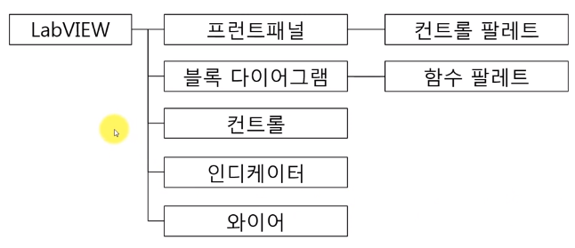

# note

# 01_구성요소, 데이터 전달, 실행

- 사용자의 입력을 받아 처리하는 것을 통틀어서 컨트롤
- 어떤 결과물을 보여주는 걸 통틀어서 인디케이터
- 컨트롤 vs 인디케이터
    - 컨트롤: 사용자의 입력을 `받는` 인터페이스
    - 인디케이터: 사용자에게 입력을 `보여주는` 인터페이스
    - 프런트패널, 블록다이어그램 둘다 추가 가능하지만 주로 프런트패널에서 생성
    - 화살표 방향으로 구별

    

- 와이어 - 데이터 전달하는 도구
    - 통로
    - 타입에 따라 다른 색깔

        

    - 컨트롤끼리(또는 인디케이터끼리) 연결시, 다른 타입 연결시 → 오류

        

- 파일 확장자 VI = virtual instrument
- 프런트 패널 = 사용자 인터페이스
    - 컨트롤 팔레트(보기)
- 블록 다이어그램 = 실제 프로그램을 하는 윈도우, 소스코드
    - 함수 팔레트: 연산을 위한 함수
- 실행: 단축키 Ctrl+R
- 복사: Ctrl
- 저장: Ctrl+S

# 02_입출력 아이콘 크기, 이름변경, 데이터 형식 동영상 강좌

VI 저장하기 → 다름이름으로 저장 → 복사본 열기 : 단축 Ctrl+S

- DBL: 부동소수점형 실수
- FXP: 고정소수점형 실수
- I64: 정수 64bit
- U64: unsigned(부호 없는) 정수 64bit

- 기계적 동작 설정
    - 누를때 스위치: 눌렀을 때 변환
    - 놓을때 스위치: 눌렀다가 뗄 때 변환
    - 놓을떄 래치: 눌렀다 떼는 순간에 일정 시간동안만 변환
    - preconditioned를 스위치로 줄 수 있음(나머지는 다시 원래대로 돌아오기 때문에)

- 디스플레이 여러 방식이 있음
- 옵션들은 구현하면서 익힐 것

- 열거형의 출력은 숫자
- 빨간색 삼각형: 데이터 타입이 맞지 않을 경우 데이터 크기가 더 큰쪽으로 강제 변환(파란색:정수→ 주황색:부동소수점)
- 강제변환점은 없는게 좋음

- 연습을 많이 해야 함

- 배열의 차원은 인덱스 디스플레이로 확인(인덱스 디스플레이 갯수→ 배열 차원 수)
- 와이어의 두께로 배열의 차원을 확인할 수 있음(3차원 이상은 일정)

- 컨트롤과 인디케이터를 같이 묶을 수 없음
- error cluster가 대표적

- 클러스터 원소 업데이트시 순서를 재설정 할 수 있음
- 클러스터 쓰는 이유: 코드의 모듈화, 기능별로 sub vi를 만들때 입출력 정의가 많을 때 묶어서 연결, 통쨰로 넣고 통쨰로 뺴는 기능
- 좋은 점 - 여러가지 데이터 입출력 가능
- 단점 - 속도가 느려짐, 한 가지가 변하더라도 나머지 변화에 대해 체크가 들어가기 때문

sub vi module화 하기

# 03_숫자형 함수 사용하기

- 사칙연산
    - 스칼라 또는 배열 원소 연산 가능
    - 입력원소의 갯수가 다를 경우, 원소의 갯수가 적은 쪽으로 맞춰짐

    

- 복합 연산 함수

    

    - 
- 숫자형 상수

    

    - 

- 절댓값, 올림 등
- 주사위 던지기 프로그램

    

- 숫자형 데이터의 변환

    

    - 빨간색 삼각형: 강제 변환점
    - 원치 않는 메모리 증가가 있을 수 있음